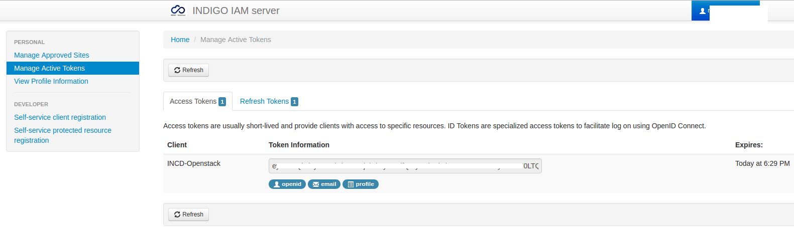

# User manual

## Command Line Interface (CLI)

You need a working installation of the OpenStack client (that is,
python-openstackclient) with a recent version of keystoneauth
(at least 2.10.0).

Moreover, should to install the `keystoneauth-oidc-authz-code` plugin if you
plan to use the OpenID Connect authorization code grant type. The package is
available in the INDIGO repositories for the distribution of your choice.

## Manual installation of CLI

You can install the client and library from PyPI:

```
# pip install python-openstackclient
# pip install keystoneauth-oidc-authz-code
```

### Usage

* Go to: https://iam-test.indigo-datacloud.eu/
* select: Manage Active Tokens
* In `access tokens` you have the client - in this case "INCD-Openstack"
and the access token
* copy paste it into a file on the client machine or:
    `export iam_at=<THE ACCESS TOKEN>`



With this access token you can obtain an openstack token:

```
$ openstack --os-auth-type v3oidcaccesstoken --os-access-token $iam_at --os-auth-url https://nimbus.ncg.ingrid.pt:5000/v3 --os-protocol oidc --os-identity-provider indigo-dc --os-identity-api-version 3 token issue

+---------+--------------------+
| Field   | Value              |
+---------+--------------------+
| expires | 2016-08-16 XXXX    |
| id      | XXXXXXXXXXXXXXX    |
| user_id | NNNNNNNNNNNNNNN    |
+---------+--------------------+
```

Note that there are at the moment two Openstack sites registered with
the IAM instance:
* test01.ifca.es
* nimbus.ncg.ingrid.pt

```
export kid=<keystone token id: XXXXX>
```
