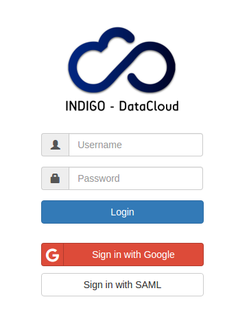

# User manual

## Openstack dashboard

Access the openstack dashboard and select INDIGO-DataCloud IAM

Connect will redirect to the IAM Indigo instance. Select the method
through which you registered previously in IAM

After successful authentication you should be authorized in the Openstack
infrastructure as part of the group/project configured by the mapping.

