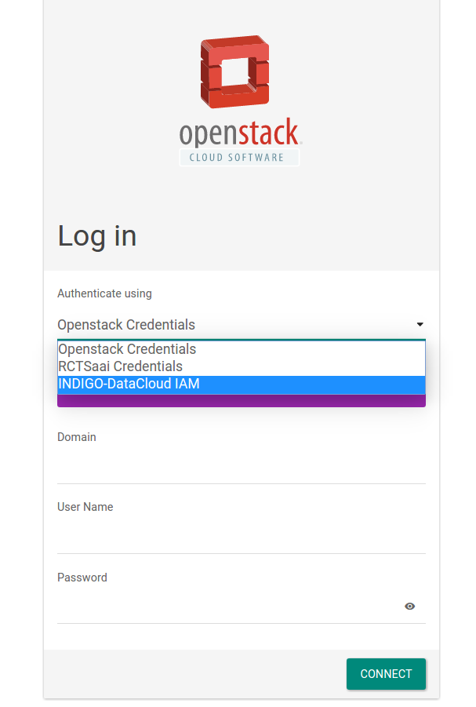
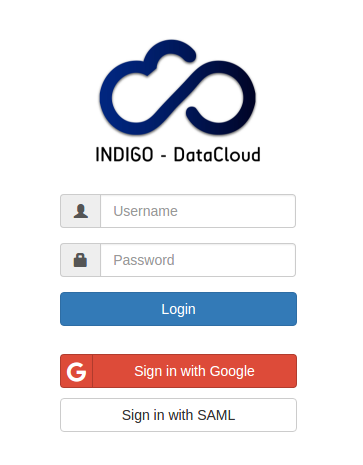
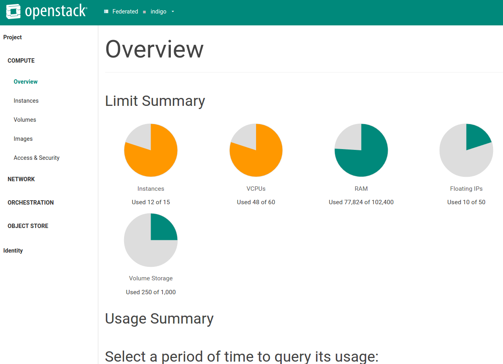

# User manual

## Openstack dashboard

Access the openstack dashboard and select INDIGO-DataCloud IAM



Connect will redirect to the IAM Indigo instance. Select the method
through which you registered previously in IAM



After successful authentication you should be authorized in the Openstack
infrastructure as part of the group/project configured by the mapping.



## Command Line Interface (CLI)

### Installation of openstacl CLI

The use of openstack CLI with OpenID connect access tokens is not yet
officially released. As such you will need to install the newest clients
from the master branch of git repositories. Install the new Openstack
client library

```
git clone https://github.com/openstack/osc-lib.git
cd osc-lib
python setup.py install
```

Install the latest Openstack CLI

```
# git clone https://github.com/openstack/python-openstackclient
# cd python-openstackclient
# pip install .
```

Check that the version of `keystoneauth1` is at least 2.11.0, if not:

`pip install -U keystoneauth1`

Check that you have at least the following versions of the clients:

```
pip list
...
keystoneauth1 (2.11.1)
osc-lib (0.4.2.dev14)
python-openstackclient (2.6.1.dev367)
...
```

### Usage

* Go to: https://iam-test.indigo-datacloud.eu/
* select: Manage Active Tokens
* In `access tokens` you have the client - in this case "INCD-Openstack"
and the access token
* copy paste it into a file on the client machine or:
    `export iam_at=<THE ACCESS TOKEN>`


With this access token you can obtain an openstack token:

```
$ openstack --os-auth-type v3oidcaccesstoken --os-access-token $iam_at --os-auth-url https://nimbus.ncg.ingrid.pt:5000/v3 --os-protocol oidc --os-identity-provider indigo-dc --os-identity-api-version 3 token issue

+---------+--------------------+
| Field   | Value              |
+---------+--------------------+
| expires | 2016-08-16 XXXX    |
| id      | XXXXXXXXXXXXXXX    |
| user_id | NNNNNNNNNNNNNNN    |
+---------+--------------------+
```

Note that there are at the moment two Openstack sites registered with
the IAM instance:
* test01.ifca.es
* nimbus.ncg.ingrid.pt

```
export kid=<keystone token id: XXXXX>
```
